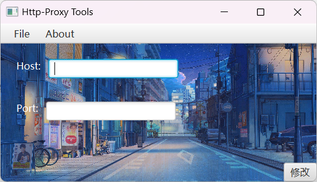

# httpProxyTools
🎉一个自用的开启系统Http代理的GUI图形化界面

2024-04-15: `New Project`:**HttpProxy_Tools**创建初衷是我很懒的每次进入Windows设置中,手动去找到**Http代理**,每次填入`host`和`port`我都觉得是很不合理的🤬,所以我创建了一个便携软件,可以到一个新环境的时候,用这个`EXE`,就可以连上我的热点从而连上国际互联网.

> 项目采用的 是纯正的Java开发的GUI,所以在美观程度上并没有很好看的样子
>
> 使用的`Jar`:由**Maven**的*javafx*

## 运行截图

## 项目结构

1. *src*文件: 存放的是项目的源码
2. *pom.xml*: 已经写入了必要的依赖

# 下续开发

## 将在后续空闲的时候,改成使用成C++或者C#开发

> 原因:**使用Java开发,需要将jar一起打包发给`User端`,对于没有Java环境的用户来说,简直灾难性,虽然你也可以改动.但是我希望使用起来是原生的感觉.**
>
> 下面是一些可能有人遇到的疑问解答
>
> *Q:为什么不使用`Electron`?*
>
> *A:用户一定不希望自己电脑还有另一个Chromium*
>
> *Q:为什么要用`Java`开发GUI*
>
> *A:因为可以很快给我自己用上,开发这个时间大概30min左右,这个算上了去下载jar的时间*
>
> *Q:可以商用吗*
>
> *A:`你不嫌弃就行`,我这个不是给生产环境开发的*
>
> 未完待续
